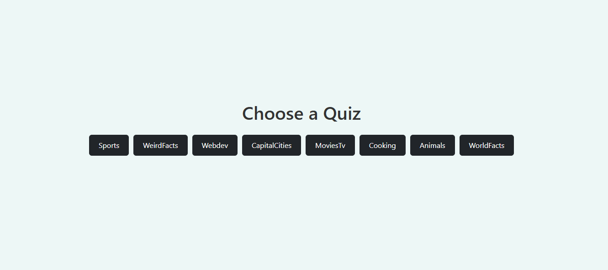

# Interactive Quiz App

A dynamic, engaging quiz application built with React featuring multiple categories, timed questions, and smooth animations. Test your knowledge across various topics with an intuitive and responsive interface.

## 🌐 Live Demo
**[View Live App](https://quiz-app-two-pied-94.vercel.app/)**
## 📸 Screenshot



---

## 🧠 Features

- **Multiple Quiz Categories**: Choose from diverse topics including:
  - Movies & Entertainment
  - Web Development
  - Capital Cities
  - And more exciting categories

- **Timed Questions**: Each question has a 20-second countdown timer
  - Automatic progression to next question when time expires
  - Visual countdown indicator for better user experience

- **Interactive Gameplay**: 
  - 10 carefully curated questions per category
  - Instant feedback on answers
  - Real-time score tracking

- **Score Summary**: Comprehensive results display at quiz completion
- **Smooth Animations**: Enhanced user experience with Framer Motion animations
- **Responsive Design**: Optimized for all devices using Bootstrap components
- **Modern Styling**: Clean interface with custom inline styling and Bootstrap buttons

## 🛠️ Technologies Used

- **React** - Frontend library for building interactive user interfaces
- **Bootstrap** - CSS framework for responsive design and button components
- **Framer Motion** - Animation library for smooth transitions and effects
- **CSS3** - Custom inline styling for enhanced visual appeal
- **JavaScript ES6+** - Modern JavaScript features and functionality

## 🚀 Getting Started

### Prerequisites
Ensure you have the following installed:
- Node.js (version 14 or higher)
- npm or yarn package manager

### Installation

1. Clone the repository:
   ```bash
   git clone https://github.com/Alvinza/Quiz-app.git
   cd quiz-app
   ```

2. Install dependencies:
   ```bash
   npm install
   # or
   yarn install
   ```

3. Start the development server:
   ```bash
   npm start
   # or
   yarn start
   ```

4. Open your browser and navigate to `http://localhost:3000`

## 🎮 How to Play

1. **Select Category**: Choose your preferred quiz category from the available options
2. **Answer Questions**: You have 20 seconds to answer each question
3. **Beat the Clock**: Questions automatically advance when time runs out
4. **Track Progress**: Monitor your performance throughout the quiz
5. **View Results**: See your final score and performance summary at the end

## 🎯 Key Features Breakdown

### Timer System
- 20-second countdown for each question
- Visual timer indicator
- Automatic question progression

### Scoring System
- Real-time score calculation
- Performance tracking across all questions
- Detailed results summary

### Animation & UX
- Smooth page transitions with Framer Motion
- Interactive button animations
- Responsive design elements


## 🔧 Development Notes

- **Styling Approach**: Combination of inline CSS and Bootstrap for optimal customization
- **Performance**: Optimized React components for smooth gameplay
- **Accessibility**: Responsive design ensures compatibility across devices
- **Code Structure**: Modular component architecture for maintainability

## 📞 Contact

For questions, suggestions, or collaboration opportunities:
- Email: alvinzondi09@gmail.com

---

**Challenge yourself and have fun learning! 🎯📚**
